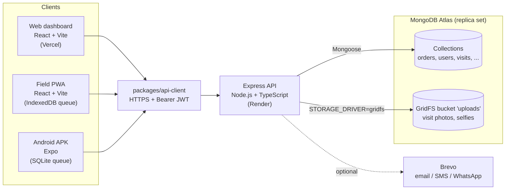

# BharatSales AI

**Field sales automation and distributor management SaaS for Indian businesses.**

BharatSales AI lets a company plan its field reps' beats, verify visits with GPS, book orders (pricing, schemes, GST, credit checks, approvals), run distributor inventory, dispatch and returns, record collections, and see it all on dashboards and a live map. It is multi-tenant, with five roles (Super Admin, Organization Admin, Sales Manager, Sales Representative, Distributor) and a sales hierarchy that limits managers to their own team.

It has three clients and one backend:

- a **web dashboard** for admins, managers, finance and distributors
- an **Android app** for field reps and distributors, which keeps working offline
- a **field PWA**: an installable web app for reps that also works offline

All three talk to a single **Node.js + Express REST API** backed by **MongoDB**.

---

## Tech stack

| Layer | Technology |
|-------|-----------|
| Backend API (`apps/api`) | **Node.js 22 + Express 4** + TypeScript, Mongoose 8, Zod validation, JWT auth, node-cron |
| Database | **MongoDB** as a replica set, because orders, dispatch, collections and sync use transactions. Uploaded photos are stored in **GridFS**. |
| Web dashboard (`apps/web`) | **React 18 + Vite**, react-router 6, Tailwind CSS, Recharts, Leaflet, shared components from `packages/ui` |
| Android app (`apps/mobile`) | **Expo** (React Native), expo-router, SQLite offline queue, EAS Build |
| Field PWA (`apps/field-pwa`) | React 19 + Vite, service worker (vite-plugin-pwa), Dexie (IndexedDB) offline queue |
| Shared packages | `api-client` (axios HTTP client), `permissions` (RBAC matrix), `shared-types`, `ui` (design system) |
| Tooling | pnpm 9 workspaces, Turborepo, Jest + Supertest + mongodb-memory-server, Playwright, GitHub Actions |
| Hosting | Render (API, `render.yaml`), Vercel (web, `apps/web/vercel.json`), MongoDB Atlas |

## Architecture



Request path inside the API: `helmet` → `compression` → `cors` (allow-list) → JSON body (2 MB) → `sanitizeInput` (NoSQL-injection guard) → global rate limit → domain router (`authenticate` → `requirePermission` → `audit` → Zod `validateBody` → service) → central error handler. Details: [docs/ARCHITECTURE.md](docs/ARCHITECTURE.md).

---

## Monorepo layout

```
bharatsales-ai/
├── apps/
│   ├── api/            # Node.js + Express REST API (port 6002)
│   │   └── src/
│   │       ├── main.ts        # boot: env validation, Mongo connect, listen, cron
│   │       ├── env.ts         # Zod validation of process.env
│   │       ├── app.ts         # Express app: middleware + router mounting
│   │       ├── container.ts   # builds models and services (explicit wiring)
│   │       ├── scheduler.ts   # node-cron jobs (Asia/Kolkata)
│   │       ├── core/          # auth/RBAC, validation, sanitize, rate limits, errors, audit
│   │       ├── <domain>/      # <domain>.routes.ts + <domain>.service.ts (+ *.spec.ts)
│   │       ├── uploads/       # photo upload, GridFS / local storage providers
│   │       ├── schemas/       # Mongoose schemas
│   │       └── seed*.ts       # seed scripts
│   ├── web/            # React + Vite dashboard (port 6003), see apps/web/UI_GUIDE.md
│   ├── mobile/         # Expo app for reps and distributors (Android APK)
│   └── field-pwa/      # React + Vite offline-first PWA for reps (port 6001)
├── packages/
│   ├── api-client/     # HTTP client + services used by web, PWA and mobile
│   ├── permissions/    # RBAC matrix (roles x resources x actions)
│   ├── shared-types/   # shared TypeScript types
│   ├── ui/             # design system: React + Tailwind components and tokens
│   └── business-rules/, validation/, config/, i18n/   # not imported by any app yet
├── e2e/                # Playwright end-to-end tests
├── infra/              # self-hosting: docker (mongo init), aws (compose + nginx)
├── docs/               # architecture, API, rules, deployment, security, runbook
├── .github/            # CI, CodeQL, Dependabot
├── docker-compose.yml  # local stack: MongoDB replica set + API + web
└── render.yaml         # Render Blueprint for the API
```

---

## Quick start (local)

**Prerequisites:** Node.js 22 (`.node-version` pins 22.23.1), pnpm 9 (`corepack enable` picks up `pnpm@9.15.9` from `package.json`), and Docker for a local MongoDB. MongoDB Atlas works too.

```bash
# 1. Install dependencies
pnpm install

# 2. Environment files (placeholders; edit JWT_SECRET at least)
cp apps/api/.env.example apps/api/.env          # read by the API at startup (dotenv)
cp apps/web/.env.example apps/web/.env.local    # VITE_API_URL=http://localhost:6002
cp apps/field-pwa/.env.example apps/field-pwa/.env.local
cp apps/mobile/.env.example apps/mobile/.env    # EXPO_PUBLIC_API_URL (use your LAN IP on a phone)

# 3. Start MongoDB as a single-member replica set (rs0 is initiated automatically)
docker compose up -d mongo

# 4. Build the shared packages once (permissions, shared-types, api-client)
pnpm --filter "@bharatsales/api..." --filter "@bharatsales/api-client" build

# 5. Seed demo data. LOCAL ONLY: this deletes the data in the target database.
#    The seed scripts do not read apps/api/.env; without MONGODB_URI they use
#    mongodb://localhost:27017/bharatsales.
pnpm --filter @bharatsales/api seed

# 6. Run everything (API, web, field PWA and the Expo dev server)
pnpm dev
#   or one at a time:
pnpm --filter @bharatsales/api dev         # http://localhost:6002
pnpm --filter @bharatsales/web dev         # http://localhost:6003
pnpm --filter @bharatsales/field-pwa dev   # http://localhost:6001
pnpm --filter @bharatsales/mobile dev      # Expo (scan the QR code with Expo Go / a dev build)
```

| Service | URL |
|---------|-----|
| Web dashboard | http://localhost:6003 |
| API | http://localhost:6002 |
| API health (pings MongoDB) | http://localhost:6002/health |
| Field PWA | http://localhost:6001 |

To run MongoDB, the API and the web build all in Docker, use `docker compose up --build`. The compose file runs the API with `NODE_ENV=production`, so first put a `JWT_SECRET` of at least 32 characters in a root `.env` (see `.env.example`), or the API refuses to start.

### Demo accounts (LOCAL SEED ONLY, never production)

`pnpm --filter @bharatsales/api seed` deletes the data in the target database and creates demo organisations with one user per role. All of them share the password `password123`, which the script prints at the end.

| Email | Role (as seeded) |
|-------|------|
| `superadmin@bharatsales.com` | Super Admin (platform operator) |
| `admin@bharatfoods.com` | Organization Admin |
| `nsm@`, `zsm@`, `rm@`, `asm@bharatfoods.com` | Sales Manager (at different hierarchy levels) |
| `rep@bharatfoods.com` | Sales Representative |
| `finance@`, `audit@bharatfoods.com` | Organization Admin (named for finance / audit, no separate role) |
| `owner@saketdist.com`, `staff@saketdist.com` | Distributor |
| `admin@rajpharma.com` | Organization Admin of a second tenant (for isolation tests) |

**These accounts are for local development and tests only. They must never exist on a shared or production database.** With `NODE_ENV=production` the seed refuses to run unless `ALLOW_PROD_SEED=true` is also set. That guard depends on `NODE_ENV` alone, so never point `MONGODB_URI` at a production cluster when you run `seed`. Create production admins with `seed:platform-admin` and a strong password (see [docs/DEPLOYMENT.md](docs/DEPLOYMENT.md#6-create-the-first-platform-admin)). If a demo account ever reaches production, delete it or change its password straight away.

---

## Tests and checks

```bash
pnpm type-check        # all workspaces (Turborepo)
pnpm lint
pnpm test              # API Jest + Supertest specs, mobile Jest (sync queue / retry policy)
pnpm build

pnpm --filter @bharatsales/api test   # API only (jest --runInBand)
npx playwright test                   # E2E: starts API, web and PWA dev servers (needs seeded MongoDB)
```

The API specs need no running database. Jest's `globalSetup` (`apps/api/src/test/global-setup.ts`) starts an in-memory single-member **replica set with mongodb-memory-server**, so transactions work. If `MONGODB_URI` is already set in the environment, that server is used instead, as CI does. The first run downloads a `mongod` binary.

CI (`.github/workflows/ci.yml`) runs on every push and pull request to `main`. It starts a MongoDB 7 replica set, then runs type-check, lint, the seed script (as a smoke test), tests and build for every workspace, plus a separate Vite build of `apps/web`. CodeQL (`security-extended`) and Dependabot are configured in `.github/`.

---

## Deployment (summary)

| Part | Where | Config |
|------|-------|--------|
| API | Render web service `bharatsales-ai` (https://bharatsales-ai.onrender.com) | `render.yaml` Blueprint |
| Web dashboard | Vercel, Root Directory `apps/web`, framework Vite | `apps/web/vercel.json` |
| Field PWA (optional) | Vercel, Root Directory `apps/field-pwa` | `apps/field-pwa/vercel.json` |
| Database + photos | MongoDB Atlas (replica set, GridFS) | `MONGODB_URI` |
| Android app | EAS Build → APK attached to a GitHub release | `apps/mobile/eas.json`, `app.json` |

Production environment on Render: `MONGODB_URI`, `JWT_SECRET` (at least 32 characters, or the API will not start), `CORS_ORIGINS` (the Vercel URL), `FRONTEND_URL`, `STORAGE_DRIVER=gridfs` and `TRUST_PROXY=1`. On Vercel: `VITE_API_URL=https://bharatsales-ai.onrender.com` (the API root, no `/api/v1`).

The APKs already installed call the live API, so API routes and response shapes must stay backward compatible.

The full step-by-step guide (Atlas, Render, Vercel, Android and a post-deploy checklist) is in **[docs/DEPLOYMENT.md](docs/DEPLOYMENT.md)**. Day-2 operations are in [docs/RUNBOOK.md](docs/RUNBOOK.md).

---

## Android app

**Download:** [BharatSales-AI-v1.0.4.apk](https://github.com/rajak73/bharatsales-ai/releases/download/v1.0.4-android/BharatSales-AI-v1.0.4.apk) (version 1.0.4, build 5). Open the link on an Android phone and allow "Install unknown apps" when prompted. The APK talks to the production API at `https://bharatsales-ai.onrender.com`.

The code in `apps/mobile/app.json` is already at `versionCode` 6, which has not been built or published yet.

**Build a new APK** with [EAS](https://docs.expo.dev/build/introduction/) (you need an Expo account with access to the project in `app.json` → `extra.eas.projectId`):

```bash
cd apps/mobile
# 1. Bump android.versionCode (and "version" if user-visible) in app.json.
#    eas.json uses appVersionSource "local", so EAS does not bump it for the preview profile.
npx eas-cli login
npx eas-cli build -p android --profile preview   # buildType "apk", EXPO_PUBLIC_API_URL from eas.json
# 2. Download the .apk from the build page, then publish it, e.g.:
gh release create v1.0.5-android BharatSales-AI-v1.0.5.apk --title "Android v1.0.5" --notes "..."
```

Before building, EAS runs the `eas-build-post-install` script, which builds `shared-types`, `permissions` and `api-client`. Details: [docs/DEPLOYMENT.md](docs/DEPLOYMENT.md#5-android-apk-eas).

---

## Security

The main controls are:

- bcrypt password hashing
- 15-minute HS256 access tokens, with rotating refresh tokens stored as hashes
- account lockout
- RBAC from `packages/permissions`, with tenant isolation taken from the verified JWT
- Zod validation that strips unknown keys
- a NoSQL operator-injection guard
- rate limits on the auth endpoints plus a global limit
- audit logs with secrets redacted
- a CORS allow-list that fails closed in production
- content-sniffed image uploads

Secrets come only from environment variables and are validated at boot. See **[docs/SECURITY.md](docs/SECURITY.md)**.

A MongoDB connection string was once committed to this repository's git history. That database user's password must be rotated. Never commit connection strings or other secrets. `.env` files are git-ignored.

---

## Documentation

- [Architecture](docs/ARCHITECTURE.md) · [API contract](docs/API_CONTRACT.md) · [ERD](docs/ERD.md)
- [Business rules](docs/BUSINESS_RULES.md) · [Permission matrix](docs/PERMISSION_MATRIX.md)
- [Offline sync](docs/OFFLINE_SYNC.md) · [Security](docs/SECURITY.md)
- [Deployment](docs/DEPLOYMENT.md) · [Runbook](docs/RUNBOOK.md) · [Known limitations](docs/KNOWN_LIMITATIONS.md)
- [UI guide (design system)](apps/web/UI_GUIDE.md) · [Changelog](CHANGELOG.md)
- Older reports and audits: [docs/archive/](docs/archive/)

## License

Proprietary. All rights reserved.
